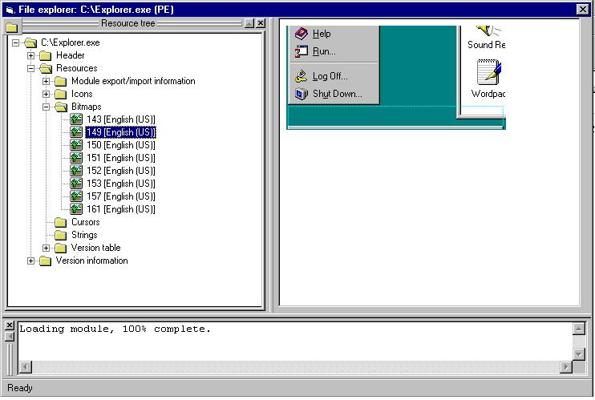



## Extract resources from an EXE \(wow\!\)

### Description

This code lets you extract resources like version tables, icons, cursors, bitmaps etc.. View dll calls, dependencies, header information and much more! Please vote if you like the code. I know it isn't perfect.
 
### More Info
 

             |
---                |---
**Submitted On**   |2000-02-03 15:42:00
**By**             |[N/A](https://github.com/Planet-Source-Code/PSCIndex/blob/master/ByAuthor/empty.md)
**Level**          |Intermediate
**User Rating**    |3.4 (54 globes from 16 users)
**Compatibility**  |VB 5\.0, VB 6\.0
**Category**       |[Complete Applications](https://github.com/Planet-Source-Code/PSCIndex/blob/master/ByCategory/complete-applications__1-27.md)
**World**          |[Visual Basic](https://github.com/Planet-Source-Code/PSCIndex/blob/master/ByWorld/visual-basic.md)
**Archive File**   |[CODE\_UPLOAD14627272001\.zip](https://github.com/Planet-Source-Code/extract-resources-from-an-exe-wow__1-15077/archive/master.zip)

